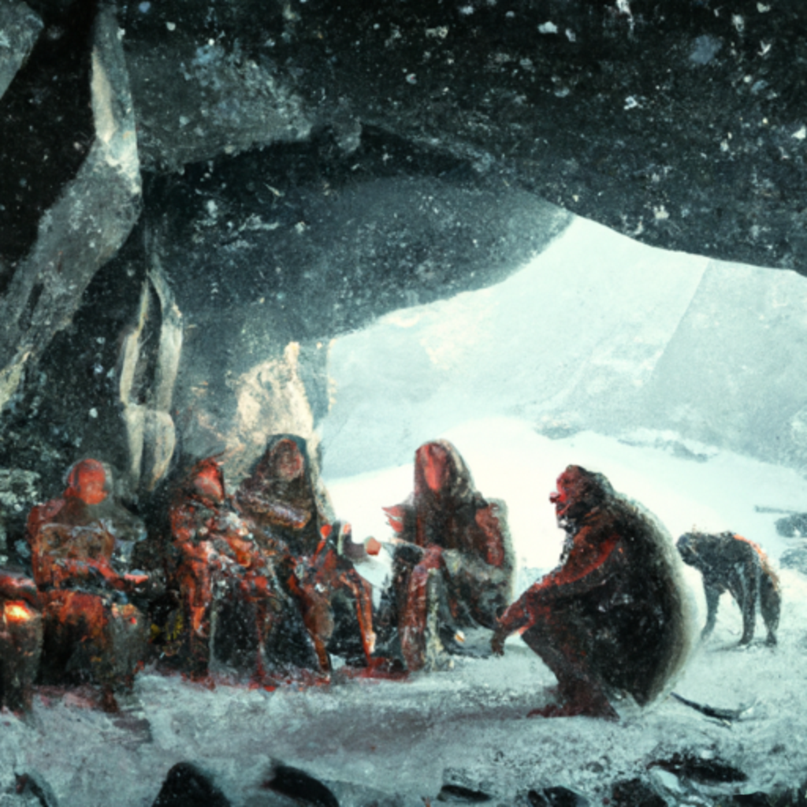
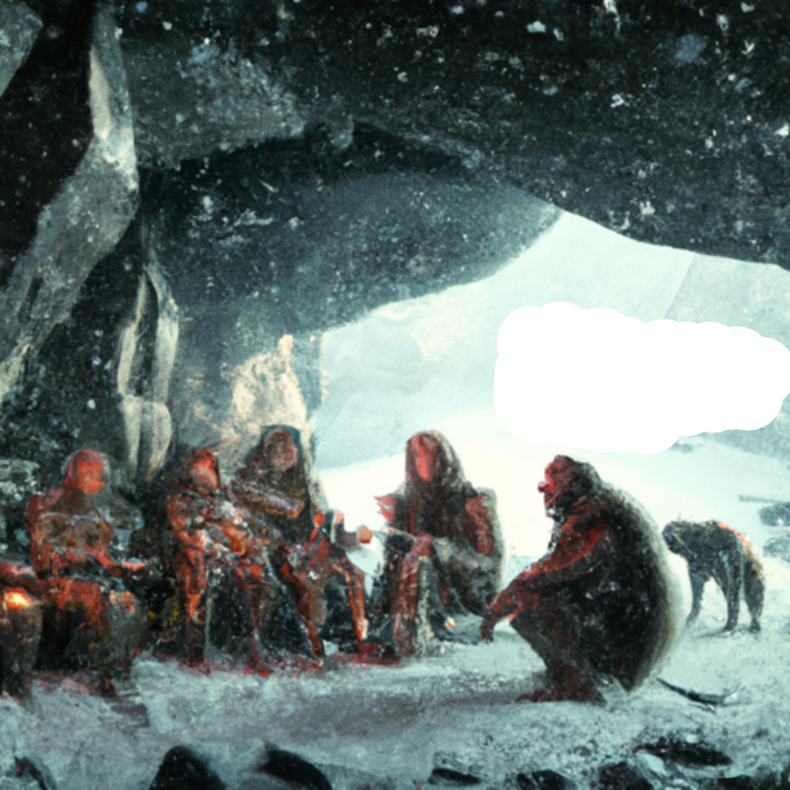
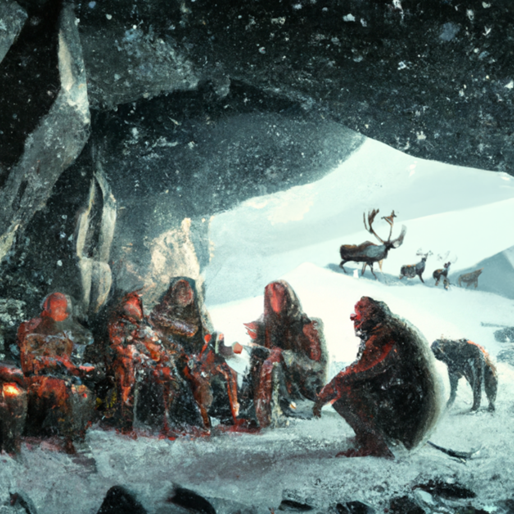
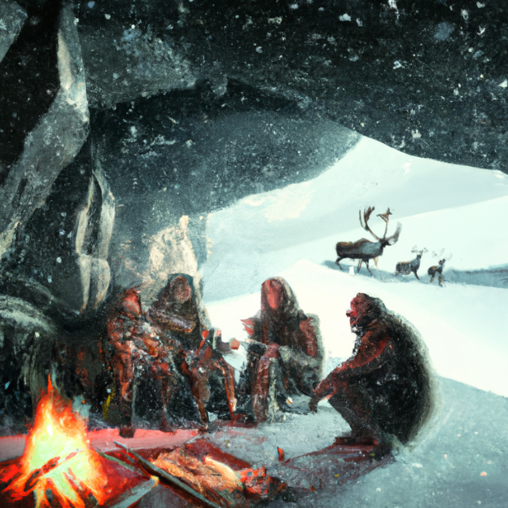
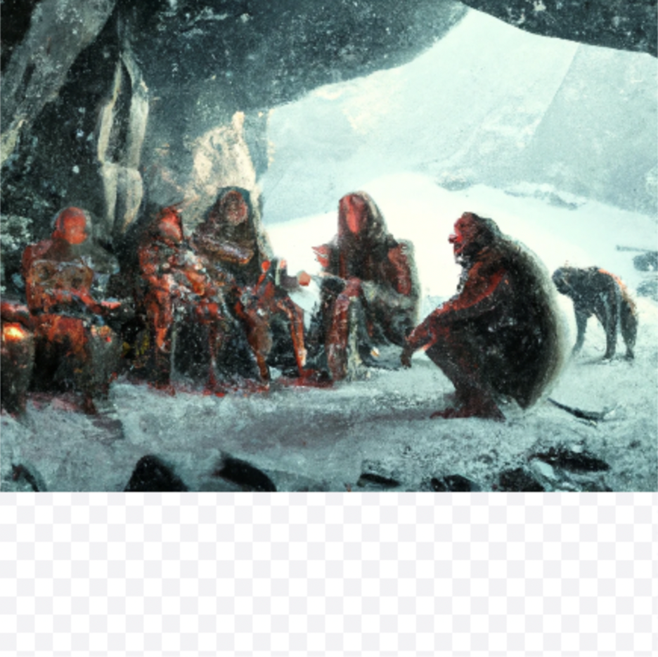

[](https://doi.org/10.5281/zenodo.7637300)

# Supplemental Code for “Artificial Intelligence and Archaeological Illustration”

The code and data in this repository can be used to programmatically
generate archaeological illustrations akin to those displayed in
[Magnani and Clindaniel “Artificial Intelligence and Archaeological Illustration”](https://doi.org/10.1017/aap.2023.25) using the OpenAI
image generation API.

The code is written in Python 3.9.7 and all of its dependencies can be
installed by running the following in the terminal (with the
`requirements.txt` file included in this repository).

``` bash
pip install -r requirements.txt
```

Then, we can import the `dalle_helpers` module located in this
repository to reproduce the workflow in the article (in a Jupyter
Notebook, like `README.ipynb` in this repository, or in any other Python
script). The `dalle_helpers` module interacts with the OpenAI API to
programmatically request DALL-E to generate and edit images on our
behalf, given text input. This programmatic description of the image
generation process can be useful for demonstrating reproducible
workflows for generating AI illustrations (outside of the DALL-E web
application GUI alone).

Note that the module assumes that you have an OpenAI API key and that
you have saved this key as an environment variable on your computer
called `OPENAI_API_KEY`. For more information on using the image API,
consult [the
documentation](https://platform.openai.com/docs/guides/images/introduction).
Once this is set up, we can import functions from the module that will
allow us to generate and edit images based on text input:

``` python
from dalle_helpers import generate_images, edit_image
```

If we provide input text related to the content of our intended image as
well as some stylistic information about what we are looking to see, we
can programmatically request DALL-E to generate multiple images (here we
request 5 images; given the stochastic nature of the image generation
model, each image will be slightly different) via the OpenAI API for us
to review and select a usable base image from:

``` python
style = ", digital art"
input_text = \
    "neandertal group sitting in a rock shelter in a cold environment"

generate_images(input_text + style, n=5)
```

This will generate (5) images such as this one and download them to our
working directory:



To modify regions of existing images (i.e. “inpainting”), we can create
a “mask” for our original image by converting a copy of the image from
RGB to RGBA format (which adds in an alpha value that determines the
transparency of the background), setting alpha to 0
(i.e. “transparent”), and erasing the area of our image that we would
like to modify.

Free photo editing tools like GIMP, will do all of this for us if we
select the eraser tool, erase the areas that we want to modify and then
export the resulting “mask” image to a PNG file that looks like so:



Once we have our mask we are happy with, we can upload both our mask
image (`mask.png`) and original image (`base_image.png`) to the OpenAI
API and to generate new objects in the transparent region of our mask
(i.e. the area that we erased) – conditioned on text we provide. Here,
let’s add some reindeer into the background:

``` python
edit_text = "Rangifer tarandus in the distance"

edit_image(
    input_text=edit_text + style,
    original_image="base_image.png",
    image_mask="mask.png",
    n=5
)
```

Which generates (5) images like this one and downloads them to our
working directory, with reindeer now included in the back (generated in
the transparent area of the image):



From here, we can continue to iteratively edit and select images until
we are finished producing our visualization (removing and adjusting
extraneous visual details that do not match our vision for the scene),
such as the following image of neandertals who interred their dead and
controlled fire (using the text input described in article body):



------------------------------------------------------------------------

**Note:** DALL-E can currently only generate images in a square frame of
one of three preset sizes (256x256, 512x512, and 1024x1024). However, if
we would like to perform “outpainting” as well (i.e. generating objects
outside the bounds of our original square image), we can use the “move”
tool in GIMP to move our image off of the transparent canvas, making it
so that the transparent space extends beyond the confines of the
original square frame of the image (and only part of the original image
is visible when we export the resulting “mask” image to a PNG file –
that which still overlaps with our transparent canvas). See for instance
a screenshot of what such a mask looks like:



We can then expand the image using DALL-E into the extended transparent
area of the mask image in the same way as we can when we were
“inpainting” above (just set the `outpainting` parameter in the
`edit_image` function to `True`). We will just need to splice the
partial images back together in GIMP when DALL-E produces an acceptable
outpainted image (our original image + the new image that extends
outside the original frame) in order to compile a complete image that
extends beyond the confines of the original square frame (if necessary
for the use-case).
